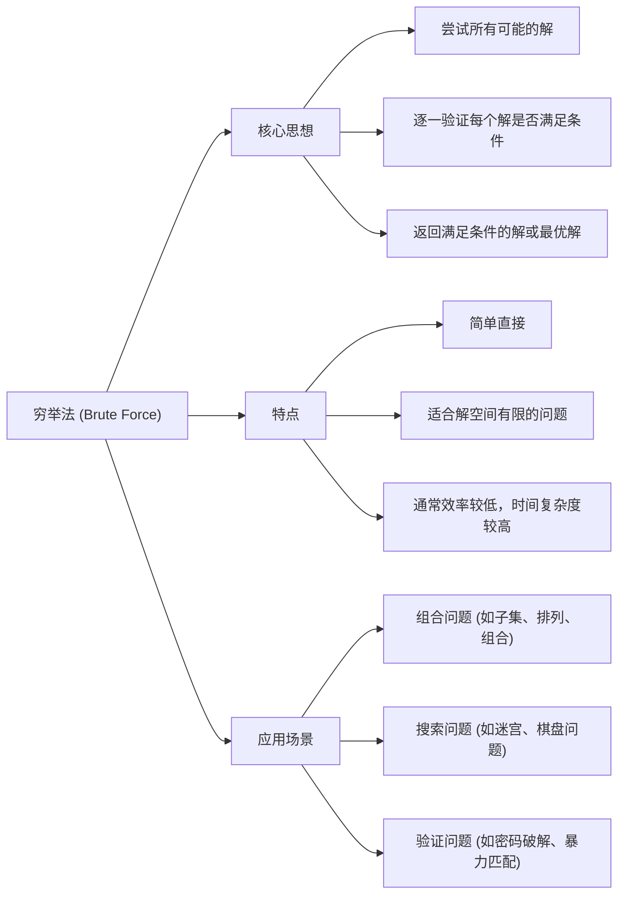

```mermaid
flowchart LR
    A["穷举法 (Brute Force)"] --> B[核心思想]
    B --> C[尝试所有可能的解]
    B --> D[逐一验证每个解是否满足条件]
    B --> E[返回满足条件的解或最优解]

    A --> F[特点]
    F --> G[简单直接]
    F --> H[适合解空间有限的问题]
    F --> I[通常效率较低，时间复杂度较高]

    A --> J[应用场景]
    J --> K["组合问题 (如子集、排列、组合)"]
    J --> L["搜索问题 (如迷宫、棋盘问题)"]
    J --> M["验证问题 (如密码破解、暴力匹配)"]
```