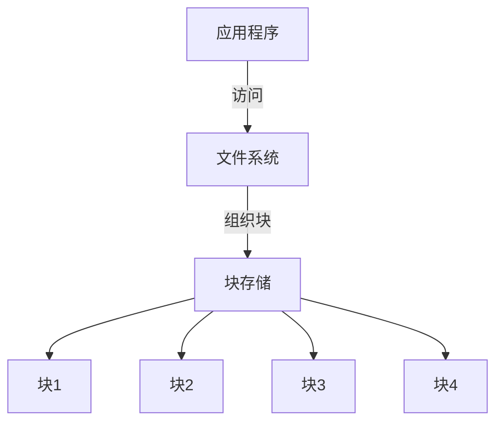
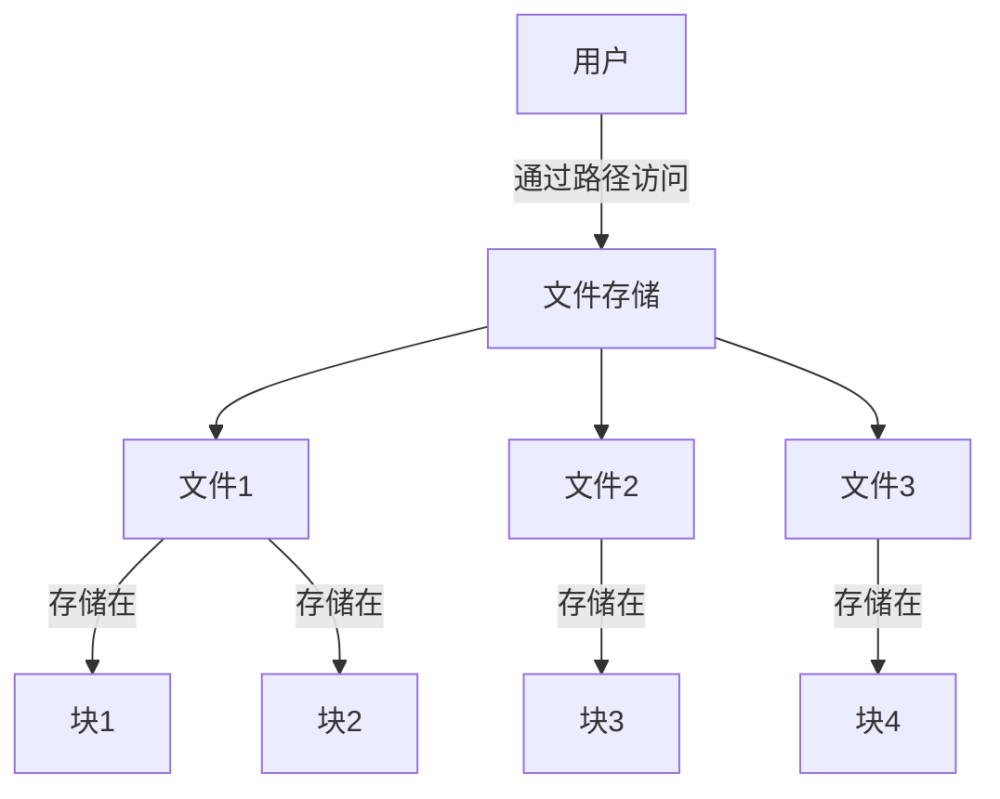
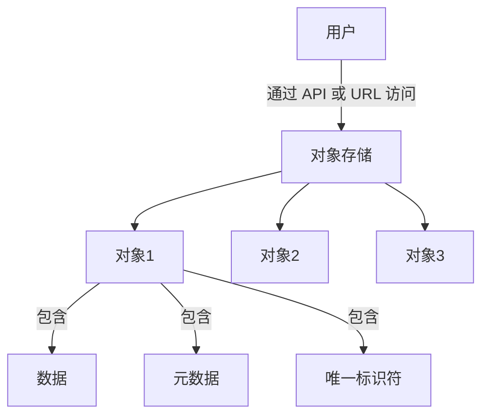
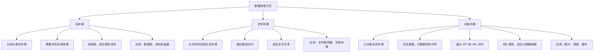

以下是使用 Markdown 的 Mermaid 绘图来讲解各种数据存储方式（块存储、文件存储、对象存储）的结构和特点。通过图示化的方式，可以更直观地理解它们的区别和应用场景。

### 块存储（Block Storage）

块存储将数据分成固定大小的块，每个块都有唯一的地址。它不关心数据的内容或文件结构，通常需要文件系统或应用程序来管理数据。

#### **特点**：
- 数据以块为单位存储。
- 需要文件系统（如 NTFS、EXT4, btrfs）来组织数据。
- 高性能，适合随机读写。
- 应用场景：数据库、虚拟机磁盘。

### 文件存储（File Storage）

文件存储以文件和目录的形式组织数据，用户通过文件路径访问数据。它是最常见的存储方式，适合需要共享文件的场景。

#### 特点
- 数据以文件和目录的形式存储。
- 用户通过文件路径访问数据。
- 适合文件共享和协作。
- 应用场景：文件服务器、文档存储。

---

###  对象存储（Object Storage）

对象存储将数据存储为对象，每个对象包含数据本身、元数据和唯一的标识符。用户通过 API 或 URL 访问对象。

#### 特点
- 数据以对象的形式存储，每个对象包含数据、元数据和唯一标识符。
- 用户通过 REST API 或 SDK 访问数据。
- 高扩展性，适合大规模数据存储。
- 应用场景：图片、视频、备份数据。

---

### 数据存储方式对比

---

### 总结

| 特性               | 块存储                          | 文件存储                          | 对象存储                          |
|--------------------|----------------------------------|------------------------------------|------------------------------------|
| **存储单位**       | 块                              | 文件和目录                        | 对象                              |
| **访问方式**       | 块号                            | 文件路径                          | API 或 URL                        |
| **管理方式**       | 需要文件系统                    | 文件系统直接管理                  | 元数据和标识符                    |
| **性能**           | 高性能，适合随机读写            | 性能较低，适合顺序读写            | 高扩展性，适合大规模数据存储       |
| **应用场景**       | 数据库、虚拟机磁盘              | 文件共享、文档存储                | 图片、视频、备份数据              |

