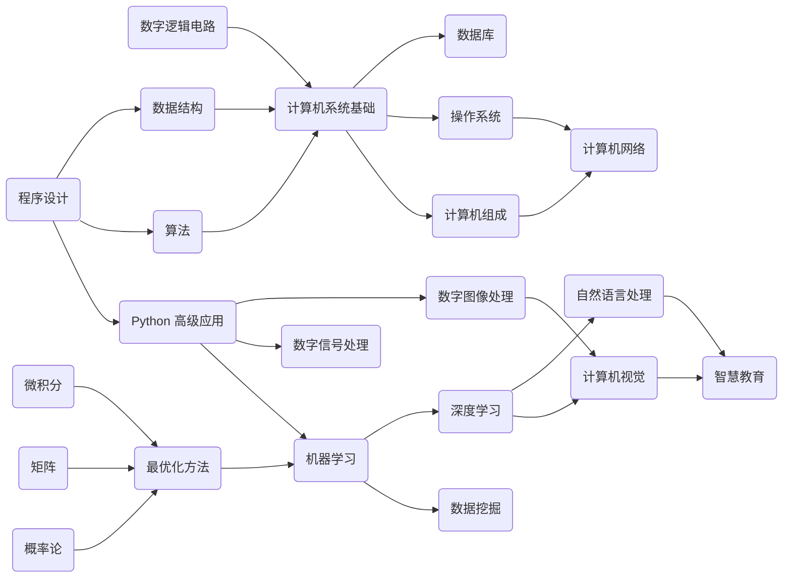
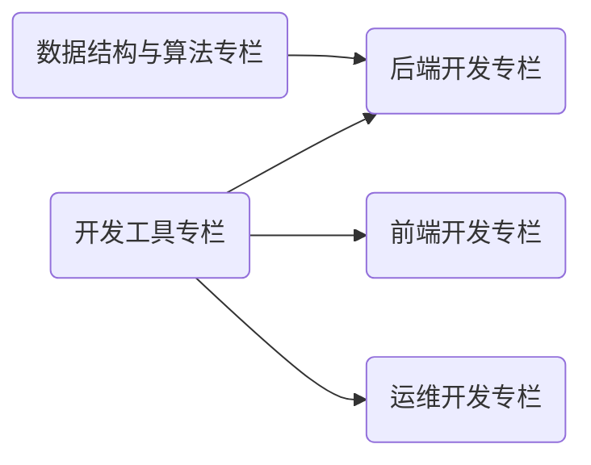

## 站点地图

```mermaid
flowchart LR
    程序设计(程序设计)
    数字逻辑电路(数字逻辑电路)
    数据结构(数据结构)
    算法(算法)
    计算机系统基础(计算机系统基础)
    数据库(数据库)
    操作系统(操作系统)
    计算机组成(计算机组成)
    计算机网络(计算机网络)

    程序设计 --> 数据结构 & 算法 --> 计算机系统基础
    数字逻辑电路 --> 计算机系统基础 --> 数据库 & 操作系统 & 计算机组成
    计算机组成 & 操作系统 --> 计算机网络

    Python高级应用(Python 高级应用)
    数字图像处理(数字图像处理)
    机器学习(机器学习)
    深度学习(深度学习)
    数据挖掘(数据挖掘)
    自然语言处理(自然语言处理)
    计算机视觉(计算机视觉)
    数字信号处理(数字信号处理)
    智慧教育(智慧教育)

    Python高级应用 --> 数字图像处理 & 数字信号处理 & 机器学习
    机器学习 --> 深度学习 & 数据挖掘
    深度学习 --> 自然语言处理 & 计算机视觉 --> 智慧教育
    数字图像处理 --> 计算机视觉

    微积分(微积分)
    矩阵(矩阵)
    概率论(概率论)
    最优化方法(最优化方法)
    微积分 & 矩阵 & 概率论 --> 最优化方法 --> 机器学习
    程序设计 --> Python高级应用

    %% 跳转链接
    click 微积分 "./base/advanced-math/"
    click 矩阵 "./base/linear-algebra/"
    click 概率论 "./base/probability-and-statistics/"
    click 最优化方法 "./base/optimization-method/"

    click 程序设计 "./base/object-oriented-programming/"
    click 数字逻辑电路 "./base/digital-logic-circuit/"
    click 计算机系统基础 "./base/computer-system-basic/"
    click 数据库 "./base/database/"
    click 数据结构与算法 "./ds-and-algo/"
    click 操作系统 "./base/operating-system/"
    click 计算机组成 "./base/computer-organization/"
    click 计算机网络 "./base/computer-network/"

    click Python高级应用 "./base/python-application/"
    click 数字图像处理 "./base/digital-image-processing/"
    click 机器学习 "./base/machine-learning/"
    click 深度学习 "./base/deep-learning/"
    click 数据挖掘 "./base/data-mining/"
    click 自然语言处理 "./base/natural-language-processing/"
    click 计算机视觉 "./base/computer-vision/"
    click 数字信号处理 "./base/digital-signal-processing/"
    click 智慧教育 "./base/intelligent-education/"
```
<table>
<caption> 拓扑图 1. AI \ CS \ ES 学科笔记 </caption>
</table>

```mermaid 
graph LR
  %% 实体定义
  algo(数据结构与算法专栏)
  dev_tools(开发工具专栏)
  fe(前端开发专栏)
  be(后端开发专栏)
  dev_ops(运维开发专栏)
  
  %% 关系定义
  algo --> be
  dev_tools --> fe & be & dev_ops
  
  %% 跳转链接
  click algo "./ds-and-algo/"
  click dev_tools "./dev-tools/"
  click fe "./front-end/"
  click be "./back-end/"
  click dev_ops "./operation/"
```
<table>
<caption> 拓扑图 2. 开发技术文章 </caption>
</table>